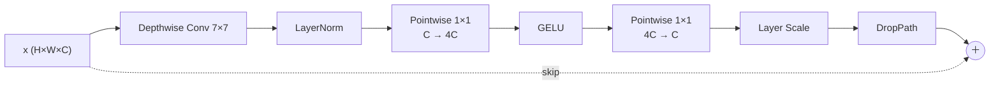

# Phân loại mặt cắt siêu âm tim thai nhi 3 tháng đầu bằng Deep Learning

Đồ án tốt nghiệp — phân loại mặt cắt (view) siêu âm tim thai giai đoạn 3 tháng đầu
thai kỳ, dựa trên **ConvNeXt**, hướng tới triển khai trên thiết bị biên (Jetson Nano).

## Giới thiệu

Siêu âm tim thai giai đoạn 3 tháng đầu còn ít được nghiên cứu: tim thai rất nhỏ, độ
phân giải thấp, ảnh nhiều nhiễu và ảnh hưởng của chuyển động thai nhi. Đề tài xây dựng
mô hình tự động phân loại mặt cắt tim thai thành các nhãn chuẩn.

## Bài toán & dữ liệu

- **Bài toán:** phân loại ảnh nhiều lớp (5 nhãn), dữ liệu mất cân bằng.
- **Dataset:** FEFT (Fetal Echocardiography First Trimester Dataset) — Figshare,
  thu thập bởi GINECHO & ĐH Y Dược Craiova (Romania). Tập test: 1.379 ảnh.
- **5 nhãn:** `Aorta`, `Flows`, `V-sign`, `X-sign` (khó nhất, thiểu số), `Other`.

## Hướng tiếp cận

- **Baseline paper:** DenseNet-201 + CBAM + Focal Loss + Progressive 3-Phase KD → Macro F1 = 93.00%.
- **Hiện tại:** ConvNeXt-Tiny + Focal Loss → Macro F1 = 95.08% (+2.08% so với paper).
- **Mục tiêu Q1:** mạng **multi-exit (suy luận theo độ khó)** + **knowledge distillation
  tập trung lớp khó** + tối ưu triển khai trên **Jetson Nano**.
  Chi tiết xem `Bao-cao-tuan1.docx` và `mục tiêu là Q1 tốt.docx`.

## Kiến trúc ConvNeXt (tham khảo)

> Vẽ bằng **Mermaid** (code markdown — tự render thành hình trên GitHub / VS Code
> Markdown Preview, không cần file ảnh).

```mermaid
flowchart LR
    IN["Ảnh vào<br/>224×224×3"] --> STEM["Stem<br/>Conv 4×4, s=4<br/>56×56×96"]
    STEM --> S1["Stage 1<br/>3× Block<br/>56×56×96"]
    S1 --> D1["Downsample<br/>Conv 2×2, s=2<br/>28×28×192"]
    D1 --> S2["Stage 2<br/>3× Block<br/>28×28×192"]
    S2 --> D2["Downsample<br/>Conv 2×2, s=2<br/>14×14×384"]
    D2 --> S3["Stage 3<br/>9× Block<br/>14×14×384"]
    S3 --> D3["Downsample<br/>Conv 2×2, s=2<br/>7×7×768"]
    D3 --> S4["Stage 4<br/>3× Block<br/>7×7×768"]
    S4 --> HEAD["Head<br/>Global Avg Pool + FC<br/>5 lớp view"]

    classDef gray fill:#4A4A4A,color:#fff,stroke:#333
    classDef stem fill:#2E5A88,color:#fff,stroke:#333
    classDef stage fill:#3C8DBC,color:#fff,stroke:#333
    classDef down fill:#E08A2B,color:#fff,stroke:#333
    classDef head fill:#8E44AD,color:#fff,stroke:#333
    class IN gray
    class STEM stem
    class S1,S2,S3,S4 stage
    class D1,D2,D3 down
    class HEAD head
```



**Bên trong một ConvNeXt Block** (inverted bottleneck + residual):



## Cấu trúc thư mục

```text
IT2058-HeThongThongMinhBien/
├── README.md
├── Bao-cao-tuan1.docx
└── mục tiêu là Q1 tốt.docx
```

## Ghi chú

(Mã nguồn, kết quả thực nghiệm, tiến độ... sẽ cập nhật dần.)
